# ccpm-fabro Implementation Plan

> **For agentic workers:** REQUIRED SUB-SKILL: Use superpowers:subagent-driven-development (recommended) or superpowers:executing-plans to implement this plan task-by-task. Steps use checkbox (`- [ ]`) syntax for tracking.

**Goal:** A global Claude Code skill that scans a ccpm-managed GitHub backlog, selects issues with no unmet dependencies, drives a TDD Fabro workflow to open a PR for each, and syncs status back to the issues.

**Architecture:** Coordinator/worker split. The **skill** (markdown + small JS helpers) does ready-check selection, confirmation, GitHub write-backs, and GH↔Fabro reconciliation. A bundled **Fabro workflow** `ccpm-tdd-issue` does the actual TDD implement→PR, run per issue against a **local** clone (sequential — local sandbox shares one workspace).

**Tech Stack:** Bun (JS helpers + `bun test`), `gh` CLI, Fabro CLI (`fabro run`/`validate`), Graphviz `.fabro` workflow.

## Global Constraints

- Skill install path: `~/.claude/skills/ccpm-fabro/` (global, reusable across repos).
- JS helpers are `.mjs`, runnable by `bun`; tests use `bun:test`, run with `bun test`.
- Package manager is **bun** only (never npm/npx/yarn).
- Dependency source is **GitHub issue bodies** (`depends_on:` / "Blocked by #N"); no local ccpm epic files are assumed.
- Fabro runs use the **local** sandbox and are launched from inside the target repo clone; processing is **sequential**.
- No auto-merge. Auto-**close** only issues whose PR is already MERGED.
- Prompts in `.fabro` reference the issue number as `$goal` (consistent with the existing `implement-issue` workflow), passed via `fabro run … --goal <n>`.
- **Commits are optional** and only per the user's "commit only when asked" rule; `~/.claude` may be dotfiles-tracked. Commit steps below are checkpoints — skip if the user hasn't asked.
- No AI attribution in any commit/PR/comment text.

---

## File Structure

```
~/.claude/skills/ccpm-fabro/
  SKILL.md                         # coordinator procedure (the loop)
  references/ready-check.md        # dependency-parse rules + examples
  lib/parse.mjs                    # pure: parseDependsOn, computeReady
  lib/parse.test.mjs               # bun tests for parse.mjs
  lib/manifest.mjs                 # pure: reconcile()
  lib/manifest.test.mjs            # bun tests for manifest.mjs
  lib/ready-check.mjs              # CLI: gh → computeReady → ranked JSON
  lib/sync.mjs                     # CLI: manifest reconcile → close-on-merge actions
  workflows/ccpm-tdd-issue/
    workflow.fabro                 # TDD graph
    workflow.toml                  # local sandbox + gh permissions
```

Per-target-repo (created at runtime, gitignored): `.ccpm-fabro/manifest.json`.

---

### Task 1: Dependency parser (pure)

**Files:**
- Create: `~/.claude/skills/ccpm-fabro/lib/parse.mjs`
- Test: `~/.claude/skills/ccpm-fabro/lib/parse.test.mjs`

**Interfaces:**
- Produces: `parseDependsOn(body: string): number[]`, `computeReady(openIssues: {number:number, body:string}[], stateMap: Map<number,'OPEN'|'CLOSED'>): {number:number, body:string}[]`

- [ ] **Step 1: Create skill dir and write the failing test**

```bash
mkdir -p ~/.claude/skills/ccpm-fabro/lib ~/.claude/skills/ccpm-fabro/references ~/.claude/skills/ccpm-fabro/workflows/ccpm-tdd-issue
```

`lib/parse.test.mjs`:
```js
import { test, expect } from "bun:test";
import { parseDependsOn, computeReady } from "./parse.mjs";

test("array form depends_on: [1, 2]", () => {
  expect(parseDependsOn("depends_on: [1, 2]")).toEqual([1, 2]);
});

test("empty and none forms yield no deps", () => {
  expect(parseDependsOn("depends_on: []")).toEqual([]);
  expect(parseDependsOn("depends_on: none")).toEqual([]);
});

test("inline comma form depends_on: 3, 4", () => {
  expect(parseDependsOn("depends_on: 3, 4")).toEqual([3, 4]);
});

test("prose 'Blocked by #5' is captured", () => {
  expect(parseDependsOn("Some text.\nBlocked by #5\nmore")).toEqual([5]);
});

test("no marker means no deps", () => {
  expect(parseDependsOn("> Part of epic #22\n# Task: x")).toEqual([]);
});

test("dedupes ids across forms", () => {
  expect(parseDependsOn("depends_on: [7]\nDepends on #7").sort()).toEqual([7]);
});

test("computeReady keeps issues whose deps are all CLOSED", () => {
  const issues = [
    { number: 10, body: "depends_on: [1]" },
    { number: 11, body: "depends_on: [2]" },
    { number: 12, body: "no deps" },
  ];
  const state = new Map([[1, "CLOSED"], [2, "OPEN"]]);
  expect(computeReady(issues, state).map(i => i.number)).toEqual([10, 12]);
});

test("computeReady treats a dep missing from stateMap as blocking", () => {
  const issues = [{ number: 20, body: "depends_on: [99]" }];
  expect(computeReady(issues, new Map()).map(i => i.number)).toEqual([]);
});
```

- [ ] **Step 2: Run test to verify it fails**

Run: `cd ~/.claude/skills/ccpm-fabro && bun test lib/parse.test.mjs`
Expected: FAIL — cannot resolve `./parse.mjs`.

- [ ] **Step 3: Write minimal implementation**

`lib/parse.mjs`:
```js
// Extract dependency issue ids from a ccpm issue body.
// Supported: `depends_on: [1,2]`, `depends_on: 1, 2`, `depends_on: none/[]`,
// and prose "Blocked by #N" / "Depends on #N". Multi-line list forms are a
// documented limitation (see references/ready-check.md).
export function parseDependsOn(body) {
  if (!body) return [];
  const ids = new Set();
  const line = body.match(/depends_on:[ \t]*([^\n]*)/i);
  if (line) for (const m of line[1].matchAll(/\d+/g)) ids.add(Number(m[0]));
  for (const m of body.matchAll(/(?:blocked by|depends on)\s*#(\d+)/gi)) ids.add(Number(m[1]));
  return [...ids];
}

// Keep only open issues whose every dependency is CLOSED in stateMap.
// A dependency absent from stateMap is treated as not-satisfied (blocking).
export function computeReady(openIssues, stateMap) {
  return openIssues.filter(issue =>
    parseDependsOn(issue.body).every(dep => stateMap.get(dep) === "CLOSED")
  );
}
```

- [ ] **Step 4: Run test to verify it passes**

Run: `cd ~/.claude/skills/ccpm-fabro && bun test lib/parse.test.mjs`
Expected: PASS (8 tests).

- [ ] **Step 5 (optional): Commit**

```bash
git -C ~/.claude add skills/ccpm-fabro/lib/parse.mjs skills/ccpm-fabro/lib/parse.test.mjs 2>/dev/null && git -C ~/.claude commit -m "feat(ccpm-fabro): dependency parser + readiness" 2>/dev/null || true
```

---

### Task 2: ready-check CLI

**Files:**
- Create: `~/.claude/skills/ccpm-fabro/lib/ready-check.mjs`

**Interfaces:**
- Consumes: `parseDependsOn`, `computeReady` from Task 1.
- Produces: CLI `bun lib/ready-check.mjs <owner/repo>` → prints JSON array of ready issues, ranked, each `{number, title, epic}`. Rank: group by epic label, then ascending issue number.

- [ ] **Step 1: Write the CLI**

`lib/ready-check.mjs`:
```js
#!/usr/bin/env bun
import { computeReady } from "./parse.mjs";

const repo = process.argv[2];
if (!repo) { console.error("usage: ready-check.mjs <owner/repo>"); process.exit(2); }

const sh = async (args) => {
  const p = Bun.spawn(["gh", ...args], { stdout: "pipe", stderr: "pipe" });
  const out = await new Response(p.stdout).text();
  if ((await p.exited) !== 0) throw new Error(await new Response(p.stderr).text());
  return out;
};

// Open task issues (candidates) + full state map (all issues, any state).
const open = JSON.parse(await sh([
  "issue", "list", "--repo", repo, "--state", "open", "--label", "task",
  "--limit", "500", "--json", "number,title,body,labels",
]));
const all = JSON.parse(await sh([
  "issue", "list", "--repo", repo, "--state", "all",
  "--limit", "1000", "--json", "number,state",
]));
const stateMap = new Map(all.map(i => [i.number, i.state]));

const epicOf = (i) => (i.labels.find(l => l.name !== "task" && l.name !== "epic")?.name) ?? "";
const ready = computeReady(open, stateMap)
  .map(i => ({ number: i.number, title: i.title, epic: epicOf(i) }))
  .sort((a, b) => a.epic.localeCompare(b.epic) || a.number - b.number);

console.log(JSON.stringify(ready, null, 2));
```

- [ ] **Step 2: Smoke it against the real backlog (read-only)**

Run: `cd ~/.claude/skills/ccpm-fabro && bun lib/ready-check.mjs inkan-tech/proclaw-reloaded`
Expected: a JSON array of ready `task` issues (subset of the ~15 open tasks), sorted by epic then number. No writes performed.

- [ ] **Step 3 (optional): Commit**

```bash
git -C ~/.claude add skills/ccpm-fabro/lib/ready-check.mjs 2>/dev/null && git -C ~/.claude commit -m "feat(ccpm-fabro): ready-check CLI" 2>/dev/null || true
```

---

### Task 3: Manifest reconcile (pure) + sync CLI

**Files:**
- Create: `~/.claude/skills/ccpm-fabro/lib/manifest.mjs`
- Test: `~/.claude/skills/ccpm-fabro/lib/manifest.test.mjs`
- Create: `~/.claude/skills/ccpm-fabro/lib/sync.mjs`

**Interfaces:**
- Produces: `reconcile(manifest: Entry[], prStateById: Map<number,{prState:string, issueState:string}>): {toClose:number[], drift:{issue:number,reason:string}[], updated: Entry[]}` where `Entry = {issue, epic, fabro_run_id, branch, pr_url, status, updated}` and `status ∈ 'in-progress'|'in-review'|'blocked'|'done'`.

- [ ] **Step 1: Write the failing test**

`lib/manifest.test.mjs`:
```js
import { test, expect } from "bun:test";
import { reconcile } from "./manifest.mjs";

const entry = (issue, status) => ({
  issue, epic: "e", fabro_run_id: "r", branch: "b", pr_url: "u", status, updated: "t",
});

test("merged PR on an open issue is scheduled to close and marked done", () => {
  const m = [entry(1, "in-review")];
  const s = new Map([[1, { prState: "MERGED", issueState: "OPEN" }]]);
  const r = reconcile(m, s);
  expect(r.toClose).toEqual([1]);
  expect(r.updated[0].status).toBe("done");
});

test("PR closed unmerged is reported as drift, not closed", () => {
  const m = [entry(2, "in-review")];
  const s = new Map([[2, { prState: "CLOSED", issueState: "OPEN" }]]);
  const r = reconcile(m, s);
  expect(r.toClose).toEqual([]);
  expect(r.drift).toEqual([{ issue: 2, reason: "PR closed unmerged" }]);
});

test("entry with no known PR/run state is drift", () => {
  const r = reconcile([entry(3, "in-progress")], new Map());
  expect(r.drift).toEqual([{ issue: 3, reason: "no run/PR state found" }]);
});
```

- [ ] **Step 2: Run test to verify it fails**

Run: `cd ~/.claude/skills/ccpm-fabro && bun test lib/manifest.test.mjs`
Expected: FAIL — cannot resolve `./manifest.mjs`.

- [ ] **Step 3: Write minimal implementation**

`lib/manifest.mjs`:
```js
// Reconcile the local backlog manifest against observed PR/issue state.
// Only already-MERGED PRs trigger an auto-close; everything else surfaces as drift.
export function reconcile(manifest, prStateById) {
  const toClose = [];
  const drift = [];
  const updated = manifest.map(e => {
    const s = prStateById.get(e.issue);
    if (!s) { drift.push({ issue: e.issue, reason: "no run/PR state found" }); return e; }
    if (s.prState === "MERGED" && s.issueState === "OPEN") {
      toClose.push(e.issue);
      return { ...e, status: "done" };
    }
    if (s.prState === "CLOSED") drift.push({ issue: e.issue, reason: "PR closed unmerged" });
    return e;
  });
  return { toClose, drift, updated };
}
```

- [ ] **Step 4: Run test to verify it passes**

Run: `cd ~/.claude/skills/ccpm-fabro && bun test lib/manifest.test.mjs`
Expected: PASS (3 tests).

- [ ] **Step 5: Write the sync CLI**

`lib/sync.mjs`:
```js
#!/usr/bin/env bun
// Usage: sync.mjs <owner/repo> <path-to-manifest.json>
// Reconciles the manifest against live PR/issue state, closes merged issues,
// rewrites the manifest, and prints a drift report as JSON.
import { reconcile } from "./manifest.mjs";

const [repo, manifestPath] = process.argv.slice(2);
if (!repo || !manifestPath) { console.error("usage: sync.mjs <owner/repo> <manifest.json>"); process.exit(2); }

const sh = async (args) => {
  const p = Bun.spawn(["gh", ...args], { stdout: "pipe", stderr: "pipe" });
  const out = await new Response(p.stdout).text();
  if ((await p.exited) !== 0) throw new Error(await new Response(p.stderr).text());
  return out;
};

const manifest = JSON.parse(await Bun.file(manifestPath).text());
const prStateById = new Map();
for (const e of manifest) {
  if (!e.pr_url) continue;
  const pr = JSON.parse(await sh(["pr", "view", e.pr_url, "--json", "state"]));
  const iss = JSON.parse(await sh(["issue", "view", String(e.issue), "--repo", repo, "--json", "state"]));
  prStateById.set(e.issue, { prState: pr.state, issueState: iss.state });
}

const { toClose, drift, updated } = reconcile(manifest, prStateById);
for (const n of toClose) {
  await sh(["issue", "close", String(n), "--repo", repo, "--comment", "Auto-closed: PR merged."]);
}
await Bun.write(manifestPath, JSON.stringify(updated, null, 2));
console.log(JSON.stringify({ closed: toClose, drift }, null, 2));
```

- [ ] **Step 6 (optional): Commit**

```bash
git -C ~/.claude add skills/ccpm-fabro/lib/manifest.mjs skills/ccpm-fabro/lib/manifest.test.mjs skills/ccpm-fabro/lib/sync.mjs 2>/dev/null && git -C ~/.claude commit -m "feat(ccpm-fabro): manifest reconcile + sync CLI" 2>/dev/null || true
```

---

### Task 4: `ccpm-tdd-issue` Fabro workflow

**Files:**
- Create: `~/.claude/skills/ccpm-fabro/workflows/ccpm-tdd-issue/workflow.fabro`
- Create: `~/.claude/skills/ccpm-fabro/workflows/ccpm-tdd-issue/workflow.toml`

**Interfaces:**
- Consumes: issue number via `$goal`.
- Produces: a run that opens a PR containing `Closes #<goal>`; final node output signals `VERIFY: PASS` or `VERIFY: BLOCKED` for the skill to read.

- [ ] **Step 1: Write the workflow graph**

`workflows/ccpm-tdd-issue/workflow.fabro`:

```dot
digraph CcpmTddIssue {
    graph [
        goal="Implement a ccpm issue using TDD",
        model_stylesheet="* { model: claude-opus-4-7; }"
    ]
    rankdir=LR

    start [shape=Mdiamond, label="Start"]
    exit  [shape=Msquare, label="Exit"]

    plan [label="Plan", prompt="Fetch the GitHub issue: gh issue view $goal --json title,body,labels,comments\n\nRead the title, description, acceptance criteria, and comments. Write plan.md containing: a summary, the files to create/modify, the TDD approach, and a concrete list of test cases derived from the acceptance criteria. Respond with the path to plan.md."]

    red [label="Red", prompt="Read plan.md. Write automated tests for the acceptance-criteria test cases using the project's existing test framework and conventions. Do NOT write production code yet. Run the test suite and confirm the NEW tests fail for the right reason. Respond with the test file paths and the failing test names."]

    green [label="Green", prompt="Read plan.md and the failing tests. Implement the minimal production code to make the failing tests pass. Do NOT weaken or delete the tests. Run the new tests and confirm they pass. Respond with the list of files changed."]

    verify [label="Verify", prompt="Run the FULL project test suite (and linters/build if the project defines them). If anything fails, fix the PRODUCTION code (never weaken tests) and re-run until the whole suite passes, or you are genuinely blocked. If it all passes, respond with exactly 'VERIFY: PASS' on the first line then a one-line summary. If blocked after reasonable attempts, respond with exactly 'VERIFY: BLOCKED' on the first line then the reason and failing output."]

    pr [label="Open PR", prompt="Create a pull request for the current branch with `gh pr create`. The PR body MUST include the line 'Closes #$goal' and a concise summary of the changes and how they satisfy each acceptance criterion. Respond with the PR URL."]

    start -> plan
    plan -> red [fidelity="summary:high"]
    red -> green [fidelity="summary:high"]
    green -> verify
    verify -> pr
    pr -> exit
}
```


`workflows/ccpm-tdd-issue/workflow.toml`:
```toml
_version = 1

[workflow]
graph = "workflow.fabro"

# Run in the local sandbox against the current clone (sequential processing).
[run.environment]
id = "local"

[environments.local]
provider = "local"

# The `pr` node opens the PR itself via gh; disable Fabro's run-branch PR
# finalization so the two mechanisms don't race (same pattern as patch-cves).
[run.pull_request]
enabled = false

[run.integrations.github.permissions]
contents = "write"
pull_requests = "write"
issues = "read"
```

- [ ] **Step 2: Validate the workflow parses**

Run: `fabro validate ~/.claude/skills/ccpm-fabro/workflows/ccpm-tdd-issue/workflow.fabro`
Expected: validation success (exit 0, no errors). If it reports an unknown attribute, fix per the message and re-run.

- [ ] **Step 3 (optional): Commit**

```bash
git -C ~/.claude add skills/ccpm-fabro/workflows/ccpm-tdd-issue 2>/dev/null && git -C ~/.claude commit -m "feat(ccpm-fabro): TDD implement-issue workflow" 2>/dev/null || true
```

---

### Task 5: SKILL.md coordinator + ready-check reference

**Files:**
- Create: `~/.claude/skills/ccpm-fabro/SKILL.md`
- Create: `~/.claude/skills/ccpm-fabro/references/ready-check.md`

**Interfaces:**
- Consumes: `lib/ready-check.mjs`, `lib/sync.mjs`, `workflows/ccpm-tdd-issue`.
- Produces: the discoverable skill `ccpm-fabro`.

- [ ] **Step 1: Write `references/ready-check.md`**

```markdown
# Ready-check rules

An open issue labeled `task` is **ready** when every dependency it declares is
CLOSED on GitHub. Dependencies are parsed from the issue body by `lib/parse.mjs`:

- `depends_on: [1, 2]` → deps 1, 2
- `depends_on: 1, 2`   → deps 1, 2
- `depends_on: []` / `depends_on: none` → no deps (ready)
- prose `Blocked by #N` / `Depends on #N` → dep N
- no marker at all → no deps (ready)

**Limitation:** a multi-line bulleted `depends_on:` list is not parsed; if a repo
uses that form, extend the regex in `lib/parse.mjs` and add a test first.

A dependency id absent from the repo state map is treated as **not satisfied**
(the issue is held back) — fail safe, never implement something whose dep can't
be confirmed closed.
```

- [ ] **Step 2: Write `SKILL.md`**

````markdown
---
name: ccpm-fabro
description: Use when driving a ccpm-managed GitHub backlog through Fabro — scan task issues, pick the ones with no unmet dependencies, implement each via a TDD Fabro workflow that opens a PR, and sync status (comments, labels, close-on-merge) back to the issues. Triggers on "work the ccpm backlog", "implement ready issues with fabro", "ccpm + fabro".
---

# ccpm-fabro

Coordinator for turning ready ccpm issues into TDD PRs via Fabro. **You** (the skill)
select and sync; **Fabro** implements. Process issues **sequentially** (local sandbox
shares one workspace).

## Inputs
- `REPO` — `owner/repo` (e.g. `inkan-tech/proclaw-reloaded`).
- `CLONE_DIR` — local clone path (default `~/<repo-name>`, i.e. `$HOME/<repo-name>`).

## 0. Preflight (stop on any failure, print the exact fix)
1. `gh auth status` — must be logged in.
2. `fabro auth login` state — run `fabro ps`; if it prints "Authentication required", stop and tell the user to run `fabro auth login`.
3. Ensure the clone: if `CLONE_DIR` is missing, `gh repo clone $REPO $CLONE_DIR`.
4. Copy the workflow in if missing: `mkdir -p $CLONE_DIR/.fabro/workflows/ccpm-tdd-issue && cp ~/.claude/skills/ccpm-fabro/workflows/ccpm-tdd-issue/* $CLONE_DIR/.fabro/workflows/ccpm-tdd-issue/`.
5. Ensure `.ccpm-fabro/` is gitignored in the clone and `.ccpm-fabro/manifest.json` exists (`[]` if new).

## 1. Reconcile (keep GH↔Fabro in sync)
Run `bun ~/.claude/skills/ccpm-fabro/lib/sync.mjs $REPO $CLONE_DIR/.ccpm-fabro/manifest.json`.
Report `closed` and `drift`. This closes issues whose PRs already merged and flags anything inconsistent.

## 2. Scan & ready-check
Run `bun ~/.claude/skills/ccpm-fabro/lib/ready-check.mjs $REPO`.
Drop any issue already tracked in the manifest with status `in-progress`/`in-review`/`done`.
See `references/ready-check.md` for the readiness rules.

## 3. Confirm
Show the ranked ready list (number, title, epic). Ask the user (AskUserQuestion) to approve the whole batch or select a subset. Do not proceed without approval.

## 4. Process each selected issue (sequential)
For each issue N:
1. `gh issue edit N --repo $REPO --add-label in-progress`
2. `gh issue comment N --repo $REPO --body "Starting implementation via Fabro (ccpm-tdd-issue)."`
3. Add a manifest entry `{issue:N, epic, status:"in-progress", updated:<now>}`.
4. From inside the clone: `cd $CLONE_DIR && fabro run ccpm-tdd-issue --goal N` (add `--detach` only if you will poll; default sequential/foreground).
5. Read the run outcome:
   - Final node output starts `VERIFY: PASS` and a PR URL exists →
     - `gh issue comment N --repo $REPO --body "Implemented via Fabro. PR: <url>\n\n<summary>"`
     - `gh issue edit N --repo $REPO --remove-label in-progress --add-label in-review`
     - update manifest entry: `status:"in-review"`, `pr_url`, `branch`, `fabro_run_id`.
   - `VERIFY: BLOCKED` or run failed →
     - `gh issue comment N --repo $REPO --body "Fabro run blocked:\n<reason>"`
     - `gh issue edit N --repo $REPO --remove-label in-progress --add-label blocked`
     - update manifest entry: `status:"blocked"`.
6. Continue to the next issue regardless of one issue's failure.

## 5. Report
Summarize: processed, PRs opened, blocked, and drift from step 1.

## Notes
- Never auto-merge. Issues auto-close only on a *merged* PR, via step 1 on a later invocation.
- Labels `in-progress`/`in-review`/`blocked` may need creating once: `gh label create <name> --repo $REPO` (ignore "already exists").
````

- [ ] **Step 3: Verify the skill is well-formed**

Run: `head -5 ~/.claude/skills/ccpm-fabro/SKILL.md` and confirm valid YAML frontmatter (`name`, `description`). Run `ls ~/.claude/skills/ccpm-fabro/{lib,references,workflows}` and confirm every path referenced in SKILL.md exists.
Expected: frontmatter present; all referenced files listed.

- [ ] **Step 4 (optional): Commit**

```bash
git -C ~/.claude add skills/ccpm-fabro/SKILL.md skills/ccpm-fabro/references/ready-check.md 2>/dev/null && git -C ~/.claude commit -m "feat(ccpm-fabro): coordinator SKILL.md + ready-check reference" 2>/dev/null || true
```

---

### Task 6: Validate end-to-end on proclaw-reloaded

**Files:** none created (exercises the skill).

**Interfaces:** Consumes everything above.

- [ ] **Step 1: Dry-run selection (read-only)**

Run: `bun ~/.claude/skills/ccpm-fabro/lib/ready-check.mjs inkan-tech/proclaw-reloaded`
Expected: a ranked JSON list of ready `task` issues. Manually sanity-check 1–2 entries: open the issue, confirm any `depends_on` it lists are actually closed.

- [ ] **Step 2: Preflight the live path**

Run: `fabro ps`
Expected: authenticated (no "Authentication required"). If it fails, run `fabro auth login` and re-run. Do not proceed to Step 3 until this passes.

- [ ] **Step 3: One live issue, full path**

Pick the smallest ready `task`. Follow SKILL.md steps 0–4 for that single issue against `inkan-tech/proclaw-reloaded` cloned at `~/proclaw-reloaded`.
Expected: a branch + PR whose body contains `Closes #<n>`; the issue has an `in-review` label and a comment linking the PR; the manifest has an `in-review` entry.

- [ ] **Step 4: Reconcile re-run**

Run the skill again (steps 1–2 only). Confirm the processed issue is **skipped** in ready-check (tracked as `in-review`) and that `sync.mjs` reports it as drift-free (PR still open → no close).
Expected: idempotent — no duplicate work, no spurious close.

- [ ] **Step 5: Report results to the user**

Summarize what the dry-run selected, what the live run produced (PR URL), and any drift. Ask whether to process the rest of the batch.

---

## Self-Review

**Spec coverage:**
- Scan/select ready issues (no unmet deps) → Tasks 1, 2, 6.1. ✓
- Create a Fabro task per issue, TDD, PR → Tasks 4, 5.4. ✓
- Update the bug (comment + PR link + labels) → Task 5.4. ✓
- Keep GH↔Fabro in sync (reconcile, close-on-merge, manifest) → Tasks 3, 5.1. ✓
- Test on proclaw-reloaded → Task 6. ✓
- Global skill, sequential, GH-body deps, no auto-merge → Global Constraints + Tasks 4/5. ✓

**Placeholder scan:** No TBD/TODO; all code shown in full; commands have expected output. ✓

**Type consistency:** `parseDependsOn`/`computeReady` signatures match between Task 1 definition and Task 2 use. `reconcile` return shape (`toClose`/`drift`/`updated`) matches between Task 3 definition and `sync.mjs` use. Manifest `Entry` fields and `status` enum are consistent across Tasks 3 and 5. `$goal` / `VERIFY: PASS|BLOCKED` contract matches between Task 4 workflow and Task 5 SKILL.md reader. ✓

**Known validation risks (confirm during execution, not assumed):**
- Exact `fabro validate` acceptance of `model_stylesheet`/`fidelity` attrs (mirrors existing `implement-issue`, so expected to pass).
- Whether the local sandbox uses ambient `gh` auth vs a minted GitHub App token for the `pr` node — verified live in Task 6.3.
- `$goal` vs `{{ goal }}` interpolation — using `$goal` to match the proven `implement-issue` workflow.
